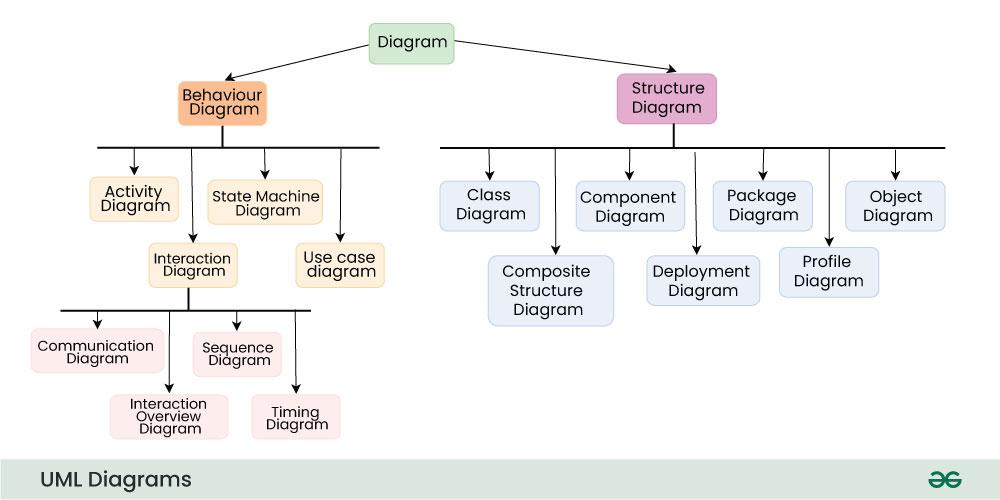

# Unified Modeling Language (UML)

Unified Modeling Language (UML) is a **general-purpose modeling language**. The main aim of UML is to define a **standard way to visualize** the way a system has been designed. 

It is quite similar to **blueprints** used in other fields of engineering.

> UML is **not a programming language**; it is rather a **visual language**.

# Types of UML Diagrams

UML diagrams are broadly categorized into two main types:

## 1. Behaviour Diagrams

These diagrams model the dynamic aspects of a system:

- **Activity Diagram**
- **State Machine Diagram**
- **Use Case Diagram**
- **Interaction Diagram**
  - Communication Diagram
  - Sequence Diagram
  - Interaction Overview Diagram
  - Timing Diagram

## 2. Structure Diagrams

These diagrams model the static aspects of a system:

- **Class Diagram**
- **Component Diagram**
- **Package Diagram**
- **Object Diagram**
- **Composite Structure Diagram**
- **Deployment Diagram**
- **Profile Diagram**
